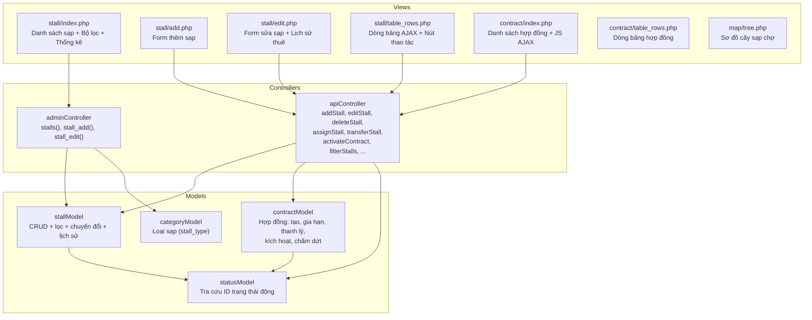
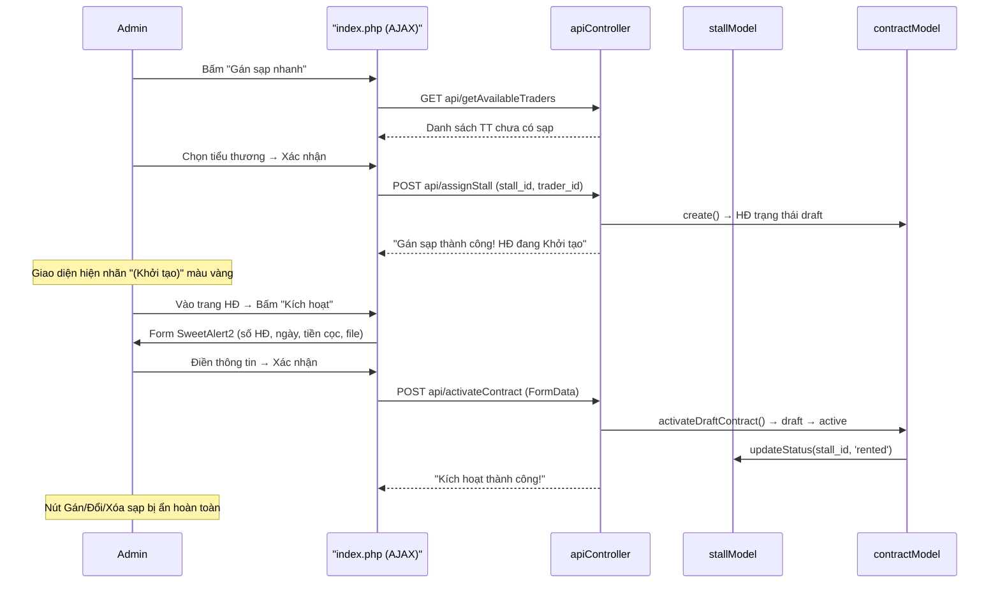
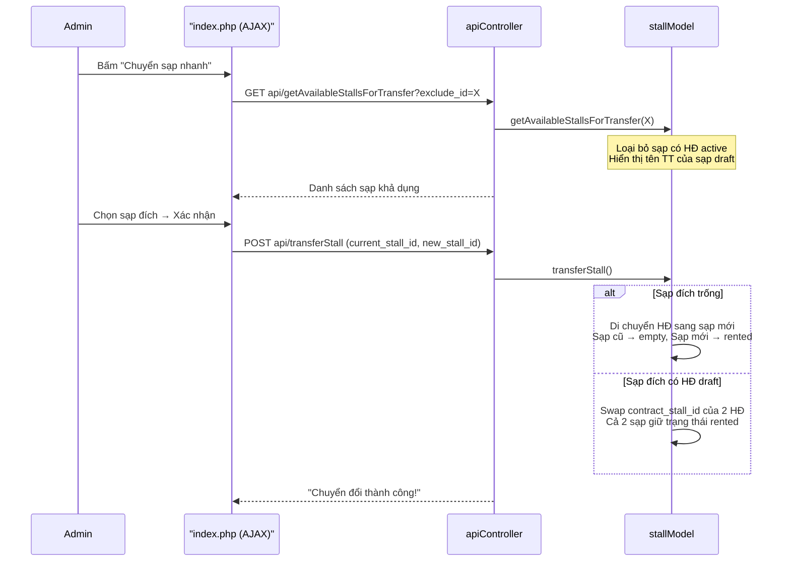
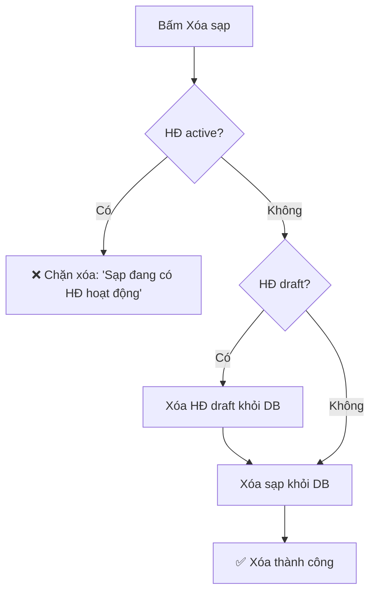

# Tổng hợp Phân hệ Quản lý Sạp chợ

## 1. Tổng quan kiến trúc

---

## 2. Bảng CSDL liên quan

| Bảng | Mô tả | Khóa chính |
|---|---|---|
| `stalls` | Thông tin sạp chợ | `stall_id` |
| `areas` | Khu vực / Phân khu chợ | `area_id` |
| `stall_types` | Danh mục loại sạp | `stall_type_id` |
| `contracts` | Hợp đồng thuê sạp | `contract_id` |
| `system_statuses` | Bảng trạng thái tập trung (domain: `stall`, `contract`, `trader`...) | `status_id` |
| `status_colors` | Màu sắc hiển thị trạng thái | `color_id` |
| `traders` | Tiểu thương | `trader_id` |
| `business_lines` | Ngành hàng kinh doanh | `line_id` |

### Trạng thái Sạp (`status_domain = 'stall'`)

| status_id | status_code | status_name |
|---|---|---|
| 3 | `empty` | Trống |
| 4 | `rented` | Đã thuê |
| 5 | `repairing` | Đang sửa chữa |
| 6 | `locked` | Tạm khóa |

### Trạng thái Hợp đồng (`status_domain = 'contract'`)

| status_id | status_code | status_name |
|---|---|---|
| 27 | `draft` | Khởi tạo |
| 11 | `active` | Hoạt động |
| 12 | `expired` | Hết hạn |
| 13 | `liquidated` | Thanh lý |
| 14 | `terminated` | Chấm dứt trước hạn |
| 25 | `99` | Đã xóa |

---

## 3. Controller — AdminController (Hiển thị trang)

| Phương thức | Route URL | Mô tả | View |
|---|---|---|---|
| [stalls()](file:///d:/xampp/htdocs/quanlycho.vn/controller/adminController.php#L97) | `admin/stalls` | Danh sách sạp + bộ lọc + thống kê | [stall/index.php](file:///d:/xampp/htdocs/quanlycho.vn/template/app/stall/index.php) |
| [stall_add()](file:///d:/xampp/htdocs/quanlycho.vn/controller/adminController.php#L257) | `admin/stall_add` | Form thêm sạp mới | [stall/add.php](file:///d:/xampp/htdocs/quanlycho.vn/template/app/stall/add.php) |
| [stall_edit($id)](file:///d:/xampp/htdocs/quanlycho.vn/controller/adminController.php#L288) | `admin/stall_edit/{id}` | Form sửa sạp + lịch sử thuê | [stall/edit.php](file:///d:/xampp/htdocs/quanlycho.vn/template/app/stall/edit.php) |
| [contracts()](file:///d:/xampp/htdocs/quanlycho.vn/controller/adminController.php#L150) | `admin/contracts` | Danh sách hợp đồng thuê sạp | [contract/index.php](file:///d:/xampp/htdocs/quanlycho.vn/template/app/contract/index.php) |
| [map_tree()](file:///d:/xampp/htdocs/quanlycho.vn/controller/adminController.php) | `admin/map_tree` | Sơ đồ cây sạp chợ | [map/tree.php](file:///d:/xampp/htdocs/quanlycho.vn/template/app/map/tree.php) |

---

## 4. Controller — ApiController (Xử lý AJAX)

| Phương thức | Route URL | HTTP | Mô tả |
|---|---|---|---|
| [addStall()](file:///d:/xampp/htdocs/quanlycho.vn/controller/apiController.php#L341) | `api/addStall` | POST | Thêm sạp mới |
| [editStall()](file:///d:/xampp/htdocs/quanlycho.vn/controller/apiController.php#L380) | `api/editStall` | POST | Sửa thông tin sạp |
| [deleteStall()](file:///d:/xampp/htdocs/quanlycho.vn/controller/apiController.php#L428) | `api/deleteStall` | POST | Xóa sạp (chặn nếu có HĐ active) |
| [filterStalls()](file:///d:/xampp/htdocs/quanlycho.vn/controller/apiController.php#L304) | `api/filterStalls` | GET | Lọc sạp AJAX (bộ lọc động) |
| [getEmptyStalls()](file:///d:/xampp/htdocs/quanlycho.vn/controller/apiController.php#L458) | `api/getEmptyStalls` | GET | Lấy sạp trống |
| [getAvailableStallsForTransfer()](file:///d:/xampp/htdocs/quanlycho.vn/controller/apiController.php#L471) | `api/getAvailableStallsForTransfer` | GET | Lấy sạp khả dụng cho chuyển đổi |
| [getAvailableTraders()](file:///d:/xampp/htdocs/quanlycho.vn/controller/apiController.php#L482) | `api/getAvailableTraders` | GET | Lấy tiểu thương chưa có sạp |
| [assignStall()](file:///d:/xampp/htdocs/quanlycho.vn/controller/apiController.php#L497) | `api/assignStall` | POST | Gán sạp nhanh → tạo HĐ draft |
| [transferStall()](file:///d:/xampp/htdocs/quanlycho.vn/controller/apiController.php#L548) | `api/transferStall` | POST | Chuyển đổi / tráo đổi sạp |
| [activateContract()](file:///d:/xampp/htdocs/quanlycho.vn/controller/apiController.php#L721) | `api/activateContract` | POST | Kích hoạt HĐ draft → active |

---

## 5. Model — stallModel

| Phương thức | Mô tả |
|---|---|
| [getAreas($marketId)](file:///d:/xampp/htdocs/quanlycho.vn/model/stallModel.php#L16) | Lấy danh sách phân khu theo chợ |
| [createArea($name, $desc)](file:///d:/xampp/htdocs/quanlycho.vn/model/stallModel.php#L27) | Tạo phân khu mới |
| [getAll($areaId, $status, $search, $marketId)](file:///d:/xampp/htdocs/quanlycho.vn/model/stallModel.php#L40) | Lấy toàn bộ sạp (có lọc thông minh theo hợp đồng thực tế) |
| [getById($stall_id)](file:///d:/xampp/htdocs/quanlycho.vn/model/stallModel.php#L92) | Lấy chi tiết 1 sạp kèm HĐ active/draft |
| [create($data)](file:///d:/xampp/htdocs/quanlycho.vn/model/stallModel.php#L108) | Thêm sạp mới (default: trạng thái `empty`) |
| [update($stall_id, $data)](file:///d:/xampp/htdocs/quanlycho.vn/model/stallModel.php#L128) | Cập nhật thông tin sạp |
| [updateStatus($stall_id, $status)](file:///d:/xampp/htdocs/quanlycho.vn/model/stallModel.php#L150) | Đổi trạng thái sạp (nhận cả code hoặc ID) |
| [delete($stall_id)](file:///d:/xampp/htdocs/quanlycho.vn/model/stallModel.php#L161) | Xóa sạp vật lý |
| [hasActiveContract($stallId)](file:///d:/xampp/htdocs/quanlycho.vn/model/stallModel.php#L169) | Kiểm tra sạp có HĐ active không |
| [isStallCodeExists($code, $excludeId)](file:///d:/xampp/htdocs/quanlycho.vn/model/stallModel.php#L178) | Kiểm tra trùng mã sạp |
| [getStallStatuses()](file:///d:/xampp/htdocs/quanlycho.vn/model/stallModel.php#L192) | Lấy danh sách trạng thái sạp |
| [getAvailableStallsForTransfer($excludeId)](file:///d:/xampp/htdocs/quanlycho.vn/model/stallModel.php#L200) | Lấy sạp khả dụng để chuyển đổi (loại bỏ sạp có HĐ active, hiển thị tên TT của sạp draft) |
| [transferStall($currentStall, $newStall, $contract1)](file:///d:/xampp/htdocs/quanlycho.vn/model/stallModel.php#L228) | Chuyển đổi / tráo đổi sạp (transaction) |
| [getRentalHistory($stallId)](file:///d:/xampp/htdocs/quanlycho.vn/model/stallModel.php#L300) | Lấy lịch sử thuê sạp |

---

## 6. Model — contractModel (liên quan sạp)

| Phương thức | Mô tả |
|---|---|
| [getAll($status, $search, $marketId)](file:///d:/xampp/htdocs/quanlycho.vn/model/contractModel.php#L14) | Lấy danh sách hợp đồng |
| [getById($contract_id)](file:///d:/xampp/htdocs/quanlycho.vn/model/contractModel.php#L54) | Chi tiết hợp đồng |
| [create($data)](file:///d:/xampp/htdocs/quanlycho.vn/model/contractModel.php#L70) | Tạo hợp đồng mới |
| [renew($id, $newEndDate)](file:///d:/xampp/htdocs/quanlycho.vn/model/contractModel.php#L125) | Gia hạn hợp đồng |
| [liquidate($id)](file:///d:/xampp/htdocs/quanlycho.vn/model/contractModel.php#L143) | Thanh lý → trả sạp về `empty` |
| [terminate($id)](file:///d:/xampp/htdocs/quanlycho.vn/model/contractModel.php#L175) | Chấm dứt trước hạn → trả sạp |
| [getActiveContractByStall($stallId)](file:///d:/xampp/htdocs/quanlycho.vn/model/contractModel.php#L275) | Lấy HĐ active của sạp |
| [getActiveOrDraftContractByStall($stallId)](file:///d:/xampp/htdocs/quanlycho.vn/model/contractModel.php#L283) | Lấy HĐ active hoặc draft của sạp |
| [activateDraftContract($id, $data)](file:///d:/xampp/htdocs/quanlycho.vn/model/contractModel.php#L311) | Kích hoạt HĐ draft → active + cập nhật thông tin + đổi sạp sang `rented` |
| [isContractNumberExists($num, $excludeId)](file:///d:/xampp/htdocs/quanlycho.vn/model/contractModel.php#L298) | Kiểm tra trùng số HĐ |

---

## 7. View Templates

### 7.1. Sạp chợ

| File | Mô tả |
|---|---|
| [stall/index.php](file:///d:/xampp/htdocs/quanlycho.vn/template/app/stall/index.php) | Trang danh sách: 4 card thống kê, bộ lọc (khu vực, trạng thái, tìm kiếm), bảng sạp AJAX, JS gán sạp nhanh + chuyển đổi sạp |
| [stall/table_rows.php](file:///d:/xampp/htdocs/quanlycho.vn/template/app/stall/table_rows.php) | Dòng bảng: hiển thị nhãn `(Khởi tạo)` cho HĐ draft, ẩn nút khi HĐ active |
| [stall/add.php](file:///d:/xampp/htdocs/quanlycho.vn/template/app/stall/add.php) | Form thêm: khu vực, mã sạp, loại sạp, diện tích, đơn giá, trạng thái |
| [stall/edit.php](file:///d:/xampp/htdocs/quanlycho.vn/template/app/stall/edit.php) | Form sửa + bảng lịch sử thuê sạp |

### 7.2. Hợp đồng

| File | Mô tả |
|---|---|
| [contract/index.php](file:///d:/xampp/htdocs/quanlycho.vn/template/app/contract/index.php) | Trang danh sách HĐ + JS AJAX: kích hoạt (form cấu hình), gia hạn, thanh lý, chấm dứt, xóa |
| [contract/table_rows.php](file:///d:/xampp/htdocs/quanlycho.vn/template/app/contract/table_rows.php) | Dòng bảng HĐ: nút Kích hoạt cho draft, nút gia hạn/thanh lý/chấm dứt cho active/expired |

### 7.3. Sơ đồ chợ

| File | Mô tả |
|---|---|
| [map/tree.php](file:///d:/xampp/htdocs/quanlycho.vn/template/app/map/tree.php) | Sơ đồ cây phân khu - dãy - sạp |

---

## 8. Luồng nghiệp vụ chính

### 8.1. Gán sạp nhanh → Kích hoạt hợp đồng

### 8.2. Chuyển đổi sạp

### 8.3. Xóa sạp

---

## 9. Quy tắc hiển thị nút thao tác trên bảng sạp

| Trạng thái sạp | HĐ | Gán sạp | Đổi sạp | Xóa sạp | Sửa sạp |
|---|---|---|---|---|---|
| Trống (`empty`) | Không có | ✅ Hiện | ❌ Ẩn | ✅ Hiện | ✅ Hiện |
| Đã thuê | `draft` (Khởi tạo) | ❌ Ẩn | ✅ Hiện | ✅ Hiện | ✅ Hiện |
| Đã thuê | `active` (Hoạt động) | ❌ Ẩn | ❌ Ẩn | ❌ Ẩn | ✅ Hiện |
| Sửa chữa / Tạm khóa | — | ❌ Ẩn | ❌ Ẩn | ✅ Hiện | ✅ Hiện |

---

## 10. Bộ lọc trạng thái sạp (Logic thông minh)

| Lọc theo | Điều kiện SQL |
|---|---|
| **Đã thuê** (`rented`) | `c.contract_id IS NOT NULL` — Chỉ lấy sạp thực sự có HĐ (active hoặc draft) |
| **Trống** (`empty`) | `c.contract_id IS NULL AND ss.status_code = 'empty'` — Chỉ sạp không có HĐ và trạng thái DB là trống |
| **Sửa chữa / Tạm khóa** | `ss.status_code = :status` — Lọc thuần theo cột trạng thái DB |

> [!IMPORTANT]
> Bộ lọc không dựa thuần vào cột `stall_status_id` mà kết hợp kiểm tra sự tồn tại thực tế của hợp đồng để tránh sai lệch dữ liệu.

---

## 11. File hỗ trợ liên quan

| File | Vai trò |
|---|---|
| [model/statusModel.php](file:///d:/xampp/htdocs/quanlycho.vn/model/statusModel.php) | Tra cứu `status_id` theo `(domain, code)` — tránh gán cứng magic numbers |
| [model/categoryModel.php](file:///d:/xampp/htdocs/quanlycho.vn/model/categoryModel.php) | Lấy danh mục loại sạp (`stall_type`) |
| [application/render.class.php](file:///d:/xampp/htdocs/quanlycho.vn/application/render.class.php) | Hàm `abort400`, `abort404`, `abort405`, `abort500`, `apiResponse`, `uploadMultipleFiles` |
| [application/marketService.class.php](file:///d:/xampp/htdocs/quanlycho.vn/application/marketService.class.php) | `currentMarketId()` — lấy ID chợ hiện tại của phiên đăng nhập |
| [model/mapModel.php](file:///d:/xampp/htdocs/quanlycho.vn/model/mapModel.php) | Truy vấn dữ liệu sơ đồ cây sạp |
